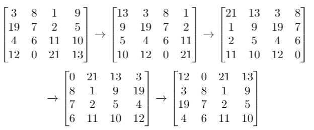

**[1260. Shift 2D Grid](https://leetcode.com/problems/shift-2d-grid/)**

Given a 2D grid of size m x n and an integer k. You need to shift the grid k times.

In one shift operation:

* Element at grid[i][j] moves to grid[i][j + 1].
* Element at grid[i][n - 1] moves to grid[i + 1][0].
* Element at grid[m - 1][n - 1] moves to grid[0][0].
Return the 2D grid after applying shift operation k times.
 
**Example 1:**


```
Input: grid = [[1,2,3],[4,5,6],[7,8,9]], k = 1
Output: [[9,1,2],[3,4,5],[6,7,8]]

```

**Example 2:**



```
Input: grid = [[3,8,1,9],[19,7,2,5],[4,6,11,10],[12,0,21,13]], k = 4
Output: [[12,0,21,13],[3,8,1,9],[19,7,2,5],[4,6,11,10]]
```

**Example 3:**

```
Input: grid = [[1,2,3],[4,5,6],[7,8,9]], k = 9
Output: [[1,2,3],[4,5,6],[7,8,9]]
```

**Constraints:**

* m == grid.length
* n == grid[i].length
* 1 <= m <= 50
* 1 <= n <= 50
* -1000 <= grid[i][j] <= 1000
* 0 <= k <= 100

**Solution:**

先求出经过变化后的数组（注意行列的求取计算方式），再转为返回值结果类型。

Runtime: 4 ms<br/>
Memory Usage: 41.7 MB

```java
class Solution {
    public List<List<Integer>> shiftGrid(int[][] grid, int k) {
        int m = grid.length, n = grid[0].length;
        Integer[][] temp = new Integer[m][n];
        k = k % (m * n);
        for(int i = 0; i < m; i++) {
            for(int j = 0; j < n; j++) {
                int row = (i + (j + k) / n) % m;
                int col = (j + k) % n;
                temp[row][col] = grid[i][j];
            }
        }
        List<List<Integer>> res = new ArrayList<>();
        for(Integer[] arr : temp) {
            res.add(Arrays.asList(arr));
        }
        return res;
    }
}

```