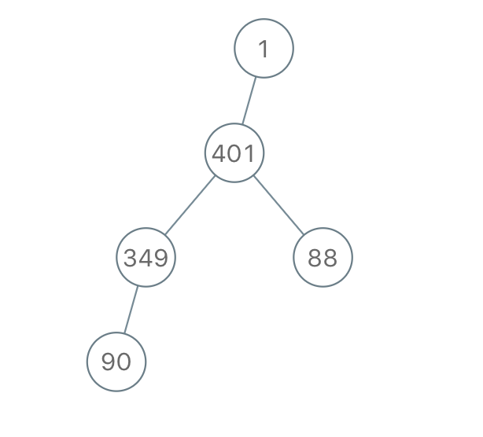

**[1028. Recover a Tree From Preorder Traversal](https://leetcode.com/problems/recover-a-tree-from-preorder-traversal/)**

We run a preorder depth first search on the root of a binary tree.

At each node in this traversal, we output D dashes (where D is the depth of this node), then we output the value of this node.  (If the depth of a node is D, the depth of its immediate child is D+1.  The depth of the root node is 0.)

If a node has only one child, that child is guaranteed to be the left child.

Given the output S of this traversal, recover the tree and return its root.

**Example 1：**


```
Input: "1-2--3--4-5--6--7"
Output: [1,2,5,3,4,6,7]

```

**Example 2：**


```
Input: "1-2--3---4-5--6---7"
Output: [1,2,5,3,null,6,null,4,null,7]

```

**Example 3：**



```
Input: "1-401--349---90--88"
Output: [1,401,null,349,88,90]

```

**Note:**

* The number of nodes in the original tree is between 1 and 1000.
* Each node will have a value between 1 and 10^9.

**Solution:**


Runtime: 1 ms<br/>
Memory Usage: 41.7 MB

```java
/**
 * Definition for a binary tree node.
 * public class TreeNode {
 *     int val;
 *     TreeNode left;
 *     TreeNode right;
 *     TreeNode(int x) { val = x; }
 * }
 */
class Solution {
    int p = 0;
    public TreeNode recoverFromPreorder(String S) {       
        return dfs(S, 0);
    }
    public TreeNode dfs(String s, int depth) {
        int countDashs = 0;
        int value = 0;
        int i = p;
        while(i < s.length() && s.charAt(i) == '-') {
            countDashs++;
            i++;
        }
        while(i < s.length() && s.charAt(i) != '-') {
            value = 10 * value + (s.charAt(i) - '0');
            i++;
        }
        if(countDashs != depth) {
            return null;
        }
        p = i;
        TreeNode node = new TreeNode(value);
        node.left = dfs(s, depth + 1);
        node.right = dfs(s, depth + 1);
        return node;
    }
}

```


