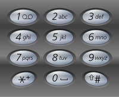

**[17. Letter Combinations of a Phone Number](https://leetcode.com/problems/letter-combinations-of-a-phone-number/)**

Given a string containing digits from 2-9 inclusive, return all possible letter combinations that the number could represent.

A mapping of digit to letters (just like on the telephone buttons) is given below. Note that 1 does not map to any letters.



**Example 1:**

```
Input: "23"
Output: ["ad", "ae", "af", "bd", "be", "bf", "cd", "ce", "cf"].

```

**Note:**

Although the above answer is in lexicographical order, your answer could be in any order you want.

**Solution:**

Runtime: 0 ms<br/>
Memory Usage: 36.3 MB

```java
class Solution {
    String[] map = new String[]{"", "", "abc", "def", "ghi", "jkl", "mno", "pqrs", "tuv", "wxyz"};
    public List<String> letterCombinations(String digits) {
        List<String> res = new ArrayList<>();
        List<String> temp = new ArrayList<>();
        if(digits == null || digits.length() == 0)
            return res;
        for(char c : digits.toCharArray()) {
            temp.add(map[c - '0']);
        }
        processRecursive(temp, res, new StringBuilder(), 0);
        return res;
    }
    
    private void processRecursive(List<String> temp, List<String> res, StringBuilder sb, int index) {
        if(temp.size() == index) {
            res.add(sb.toString());
            return;
        }
        String s = temp.get(index);
        for(int i = 0; i < s.length(); i++) {
            sb.append(s.charAt(i));            
            processRecursive(temp, res, sb, index + 1);
            sb.deleteCharAt(sb.length() - 1);
        }
    }
}
```