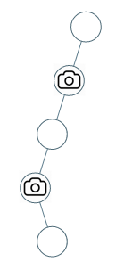

**[968. Binary Tree Cameras](https://leetcode.com/problems/binary-tree-cameras/)**

Given a binary tree, we install cameras on the nodes of the tree. 

Each camera at a node can monitor its parent, itself, and its immediate children.

Calculate the minimum number of cameras needed to monitor all nodes of the tree.

**Example 1：**


```
Input: [0,0,null,0,0]
Output: 1
Explanation: One camera is enough to monitor all nodes if placed as shown.

```

**Example 2：**



```
Input: [0,0,null,0,null,0,null,null,0]
Output: 2
Explanation: At least two cameras are needed to monitor all nodes of the tree. The above image shows one of the valid configurations of camera placement.

```

**Note:**

1. The number of nodes in the given tree will be in the range [1, 1000].
2. Every node has value 0.

**Solution:**

Runtime:  2 ms<br/>
Memory Usage: 39.8 MB

```java
/**
 * Definition for a binary tree node.
 * public class TreeNode {
 *     int val;
 *     TreeNode left;
 *     TreeNode right;
 *     TreeNode(int x) { val = x; }
 * }
 */
class Solution {
    int res;
    Set<TreeNode> set;
    public int minCameraCover(TreeNode root) {
        res = 0;
        set = new HashSet<>();
        set.add(null);
        dfs(root, null);
        return res;
    }
    public void dfs(TreeNode node, TreeNode parent) {
        if(node == null)
            return;
        dfs(node.left, node);
        dfs(node.right, node);
        if(parent == null && !set.contains(node) ||
           !set.contains(node.left) || !set.contains(node.right)) {
            res++;
            set.add(node);
            set.add(parent);
            set.add(node.left);
            set.add(node.right);
        }
    }
}

```


